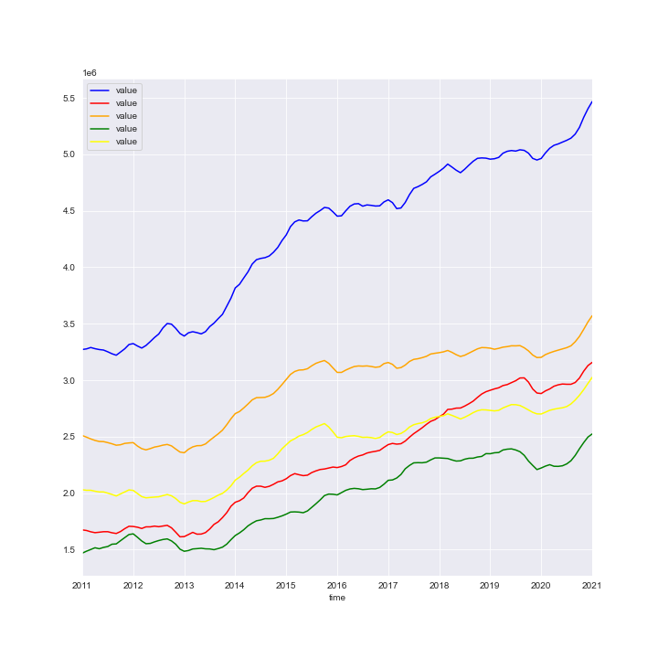

# State of New York - Zillow Housing Forecasting

**Author** Kyle Dufrane


## Business Understanding

Our stakeholder is a national real estate firm that is looking to invest in the current housing market. They're looking for the top 5 most profitable zip codes from the past 10 years in NY State.


## Data Understanding

This dataset comes from [Zillow Research](https://www.zillow.com/research/data/). The dataset selected is labeled 'ZHVI All Homes (SFR, Condo/Co-op) Time Series, Smoothed, Seasonally Adjusted' filtered by Zip Code.

To start understanding out data, we will identify what each of the first nine columns mean below: 

* RegionID: Based on my research this seems to be Zillow specific.
* SizeRank: Further analysis is needed. 
* RegionName: Zipcode
* RegionType: Denotes region type - I.E. RegionName = Zipcode
* StateName: U.S. State 
* State: U.S. State 
* City: City associated to zipcode
* Metro: Metroplitian Area
* CountyName: name of the county the zipcode resides in

Furthermore, I reviewed the SizeRank column to try to get further understanding into its meaning. This didnt lead to much insite as we have a total of 11088 total values in this column. Randomly selecting two variables I filtered the columns to see if any features would catch my eye. After a quick google search on population data I can see that the first five in the first filtered dataframe have a population of +/- 5000 from eachother with a few of them being closer to each other in total count with +/- 100. When I reviewed the second dataframe I found that population did not group these cities due to Northhampton, MA having a population of ~30,000 & Vallecito, CA havin a population ~250. This column could denote some form of county population but since our stakeholder is looking at strictly a profit investment this is unneeded noise at this point. 

Two other unrelated items did catch my eye. The first being not all zipcodes are of even legnth. As you can see with Holtsvillem, NY the zipcode is '501' which is not a valie zipcode. With a quick google search, I found that in fact '00501' is the correct zipcode for Holtsville. We will have to keep this in the back of our head later down the road and make sure to make changes as needed for our stakeholder. Secondly, we having missing values in our Metro column and our first date column. We will dive further into this in the next section. 

To conclude our data understanding section our dataset from Zillow Research contains typical home values on a monthly occurrence from 1996 to present grouped by zip code. 


## Data Preparation

To start our data cleaning process we will go back to our business understanding. Our stakeholder is only concerned with the past 10 years of price changes therefore we will filter our date columns based on this information. Moving forward our dates will be from 1-31-2011 till 1-31-2021. 

Given that we are after 10 years of data at 12 month increments we can assume that this column will be 120 rows from our total row count of 314 which should give us a good starting point to filter our data. Once I idenitifed the correct rows I concatenated a new dataframe containing only the values we're interested in. 

After the dataframe was created, I dropped all rows with NaN values to make our life easier during the modeling stage. 

Next I created a column labeled '10_yr_Profit', created a new dataframe, sorted based on those values and selected the top five zipcodes which are the most profitable over said period. 

Lastly, I subsetted all of the five zipcodes into their own dataframe, plotted the zipcodes(see below), and used the Pandas function melt to turn our data into a time series comaptible frame. 



## Modeling

To start modeling I split the five dataframes into training and testing sets than I created a baseline metric using RMSE. Once that was established I moved forward trying to stationarize the data. I was able to achieve this by apply two diff's and reviewing the Dicky Fuller test. All of the five models passed with the highest p-value being 0.012. 

During this process, I also review the ACF and PACF charts. Below is my analysis:

* 11962:

    * The ACF plot looks like we have a significance every two intervals
    * The PACF plot shows us we have significance on our second and third lag. There's almost consistency across every 3rd lag         excluding one thoughout the plot.

* 11930

    * The ACF plot looks like we have a significance every two or three intervals.
    * The PACF plot shows us we have significance on every third lag. This is definitely more pronounce over 11962

* 11976

    * The ACF plot looks like we have a significance on the first three lags of itself.
    * The PACF plot shows us we have significance on the first three lags. Again, there is almost consistency across every third       lag as previously seen.

* 11975

    * The ACF plot doesn't show us a trend excluding the yearly trend
    * The PACF plot shows consistency across every third lag

* 11932

    * The ACF plot doesn't show us a trend excluding the yearly trend
    * The PACF plot shows consistency across every third lag

Note: All plots show correlations at every 12 months

The ACF plot shows the significance level intervals of the auto-correlation of any series with its lagged value. This is denoted as our p value in the below modeling.

The PACF plot gives the partial correlation of a stationary time series with its own lagged values. this is denoted as our q value in the below modeling.¶


## Evaluation

After the analysis I looped through zipcode 11962 with different p,d,q values to find the optimal parameters and see if our inclinations are correct. I applied two false parameters being enforce_stationarity and enfore_invertibility. I filtered the dataframe by AIC value (output below):

| pdq     | pdqs       | AIC      | mse       |
|---------|------------|----------|-----------|
| (1,2,0) | (1,2,2,12) | 1.00e+01 | 2.44e+240 |
| (2,2,1) | (0,2,1,12) | 1.00e+01 | 6.44e+240 |
| (2,2,1) | (1,2,1,12) | 1.20e+01 | 7.44e+240 |
| (2,2,1) | (2,2,1,12) | 1.40e+01 | 1.92e+240 |
| (3,2,1) | (0,2,1,12) | 1.40e+01 | 8.67e+240 |

Followingn these results I ran a SARIMAX model and compared RMSE scores. Our baseline for 11962 had an RMSE of 137,444 and our output had an RMSE of 810,130. This model was substantially worse than our baseline. 

After these results I filtered by MSE to see if this gave us any improvement which it did. With these parameter changes I lowered the RMSE by ~200,000. These results are still sub par. 

Once I experienced these poor performers I moved onto Facebook Prophet. In order to run models through Prophet you need to re-label your column headers which is what I did first on all of the training and testing sets. 

I established a baseline model using zipcode 111930 with no hyper parameters and was returned with a RMSE value of 2,250,246 compared to our baseline of 95,676. Again, sub par results but this is only our baseline. 

I then created a grid search and was able to substantially decrease the RMSE value. Below are the final models results. 

| Model   | Baseline RMSE | Final Model RMSE |
|---------|---------------|------------------|
| 11962   | 137444.52     | 72699.31         |
| 11930   | 95676.52      | 68743.85         |
| 11976   | 85985.38      | 66013.33         |
| 11975   | 72822.43      | 105805.36        |
| 11932   | 80837.25      | 55328.69         |


## Next Steps

The next steps would be to deploy these machine learning concepts on a much larger scale within New York or the country. Also, we could further filter results to meet business needed. I.E. Does location matter, school districts, grocery stores? 


## For More Information

Please review our full analysis in [JupyterNotebook](Techinical_Notebook.ipynb) or my [presentation](final_presentation.pdf)

If you have any additional questions please contact me at:

    Kyle Dufrane
    
        Email: kyle.dufrane@gmail.com
        Github: kyledufrane
        
## Repository Structure

```
├── Images                          
├── src   
├── README.md         
├── Technical_Notebook.ipynb                            
└── Zip_zhvi_uc_sfrcondo_tier_0.33_0.67_sm_sa_mon_1.csv
```


